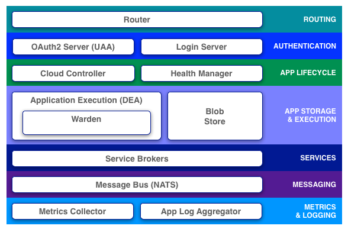

# Review of Cloud Foundry Components

Although we've touched a bit on most/all of these components through the various chapters, it is important to have a strong understanding of how everything fits together. And to have a reference moving forward.

---

[Intro to Microservices 4 pts](http://www.activestate.com/blog/2014/10/microservices-and-paas-part-iv)

---

To understand what happened when we pushed cf-env, we need to take a quick look at the components that make up Cloud Foundry:

<small>Image Credit: [Cloud Foundry Components](http://docs.cloudfoundry.org/concepts/images/cf_architecture_block.png) on http://docs.cloudfoundry.org/concepts/architecture/</small>

## Routing

Routes requests
myapp.com => random app instance/container
Balances load across DEAs
Maintains routing table in real time based on status of app instances
In the event of failure, retries request with new instance of same application

## Authentication

### OAuth2 Server (UAA)

OAuth2 server (UAA) works with the login server to manage identity. The UAA can:

Authenticate users with their CF credentials
Act as an SSO service using those credentials
Issue tokens for applications when they act on behalf of CF users

### Login Server

**TBA**

## Application Lifecycle

### Cloud Controller

The "brain" - controls/orchestrates all other components
Stores status information for other components, users, applications, and available services
Exposes REST interface for CLI commands
Binds external services (e.g. RabbitMQ, MongoDB) to the deployed applications

### Health Manager

Collects the desired state of the world (from the CC via HTTP)
Collects the actual state (from the DEAs via application heartbeats over NATS)
Performs a set diff to find discrepancies – e.g. missing apps or extra (rogue) apps
Sends START and STOP messages to resolve these discrepancies

## Application Storage and Execution

### Droplet Execution Agent

A droplet is a tarball of the application's code plus its dependencies wrapped up with the ability to start and stop
Handles running all droplets
Launches new instances, as needed, when load increases (scaling)
Monitors the applications its running, generates alerts for state changes

#### Warden

Manages isolated, ephemeral, and resource-controlled environments
Primary goal: simple API for managing isolated environments (called containers)
Each container can be limited in terms of CPU, memory, disk utilization, and network access
Currently only supported by Linux

### Blob store

Holds:

Application code
Buildpacks
Droplets
Releases are uploaded and then inserted into the Blobstore

During deployment, BOSH orchestrates the compilation of packages and stores the result in the Blobstore

## Services and Service Brokers

Connect to external services (e.g. data, messaging, caching)
Interfaced via the Service Gateway and Service Provisioning Agent

Each external service has one Service Provisioning Agent
Service Gateway is used by the Cloud Controller to provision and track external services

## Messaging (NATS)

Used by all other components for communications
Uses asynchronous messaging for scalability
Internal communications: NATS

Lightweight publish-subscribe and distributed queueing messaging system written in Ruby

## Metrics and Logging

### Metrics Collector

Gathers metrics from components
Operators can use this information for monitoring

### Logging (Loggregator)

Consolidates logs of all actions that directly affect apps
Streams logs to terminal
Keeps a limited amount of log data in memory (so eventually the newest log lines replace the oldest)
Allows logs to be drained to a third party log management service

#### Resources

* [HA/scaling components in CF](http://docs.pivotal.io/pivotalcf/concepts/high-availability.html)
* [4 Levels of HA in CF](http://blog.pivotal.io/cloud-foundry-pivotal/products/the-four-levels-of-ha-in-pivotal-cf)
