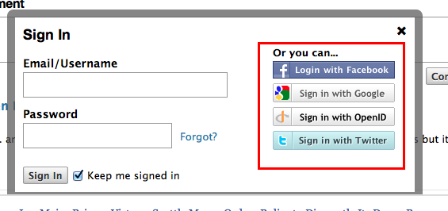

# Introduction to UAA

#### Need to add information about Login Server, 11/18/2014

For login server: https://groups.google.com/a/cloudfoundry.org/forum/#!topic/vcap-dev/BuEaZCqSjWk

---

Early in the project, Cloud Foundry developers realized they needed a standardized means of identity and user management. In order to accomplish this goal, the Identity Team developed the user authentication and authorization (UAA) service, which is comprised of:

* The UAA server
* Spring Security Oauth2 (simply referred to as Oauth2)/OpenID Connect
* UAAC (UAA command line tools)
* Authentication servers to support external sources and enterprise identity (SAML2)

## So, what does all that mean?

The UAA is used to coordinate identity operations. A "client" in the context of identity is an application doing something on behalf of the end user (or on behalf of itself). Whenever a user or application needs to pass authorization credentials through Cloud Foundry, they do so through the UAA.

## What are Oauth2 and OpenID Connect used for?

Simply put, the UAA handles authentication using Oauth2 and OpenID Connect, which allows developers to manage authentication without storing and managing passwords. Almost all users have encountered Oauth2 logins with Facebook, Google, GitHub, etc. For example, at one point or another you have probably encountered a login page that looks similar to this:

Clicking one of the "Login with.../Sign in with..." buttons provides the application in question (e.g. Etsy, Ebay) access to the account, and thus the account's credentials on the provider's servers.

## What about user management?

Users are managed using [SCIM](http://www.simplecloud.info/), which stands for "System for Cross-Domain Identity Management". Occasionally, you'll also still see this as "Simple Cloud Identity Management", which was the project name before it was aquired by the [Internet Engineering Task Force](https://www.ietf.org/).

The goal behind SCIM is conceptually simple: SaaS application developers needed a standardized way to manage cloud identities on an enterprise scale. When SCIM was being developed, there was no single standard, which left developers at the mercy of proprietary implementations developed in-house by their SaaS providers (vendor lock-in). With the advent of SCIM, developers had access to a schema that allowed them to manage user accounts, attributes, roles, and groups in a standard REST/JSON format.

#### Oh, is that all?

No, there are a lot of really interesting mechanisms involved in UAA, which could easily fill another book. I highly encourage everyone (especially Cloud Foundry admins) to take a look at the following resources:

* https://github.com/cloudfoundry/uaa/blob/master/docs/CF-Identity-Services-Preface.rst
* asd

#### For more information

* About scopes: https://github.com/cloudfoundry/uaa/blob/master/docs/UAA-Security.md
* About UAA: https://github.com/cloudfoundry/uaa/blob/master/docs/uaa_concepts.pdf (will download the PDF presentation)
* Creating admin users: http://docs.cloudfoundry.org/adminguide/uaa-user-management.html

# References

* http://docs.cloudfoundry.org/adminguide/cli-user-management.html
* https://docs.google.com/a/starkandwayne.com/document/d/1vB8bhG4OURkLx9JcoIyYdxCuosls3OQ2r7XSZFZHPHc/edit#
* http://docs.cloudfoundry.org/adminguide/uaa-user-management.html
* https://github.com/cloudfoundry/uaa/blob/master/docs/Sysadmin-Guide.rst
* local copies: uaa\_operators.pdf, uaa\_developers.pdf, **UAA\_presentation.pdf**
* https://github.com/cloudfoundry/uaa/blob/master/docs/CF-Identity-Services-Preface.rst
* http://www.simplecloud.info/specs/draft-scim-core-schema-01.html
* https://github.com/starkandwayne/trycf/blob/19638d724cfcb630a1ed7a5a6d96716c81e66a62/public/docs/upgradeTryCFPowerUser.md
* https://trycf.starkandwayne.com/docs/#!upgradeTryCFPowerUser.md
* http://support.run.pivotal.io/entries/26888363-Trouble-creating-an-admin-user
* https://github.com/cloudfoundry/uaa/blob/master/docs/CF-Identity-Services-Preface.rst
* https://github.com/pivotal-cf/pcf-training-materials/blob/master/public/labs/managingOrgsSpacesAndAccounts.md
* http://mytraining.cfapps.io/labs#!labs/managingOrgsSpacesAndAccounts.md
* ** http://openid.net/connect/faq/ **
* ** http://www.enterprisemanagement360.com/wp-content/files_mf/white_paper/simple-cloud-identity-management-scim.pdf **
* ** http://blogs.gartner.com/mark-diodati/2011/05/06/scim-and-the-future-of-standards-based-provisioning/ **
* ** https://blogs.oracle.com/fusionmiddleware/entry/standards_corner_scim_and_the **
* [UAA Concepts](https://github.com/cloudfoundry/uaa/blob/master/docs/uaa_concepts.pdf)
* [UAA PWS Blog post](http://blog.pivotal.io/cloud-foundry-pivotal/news-2/cloud-foundry-uaa-onwards-and-upwards-into-the-cloud)
